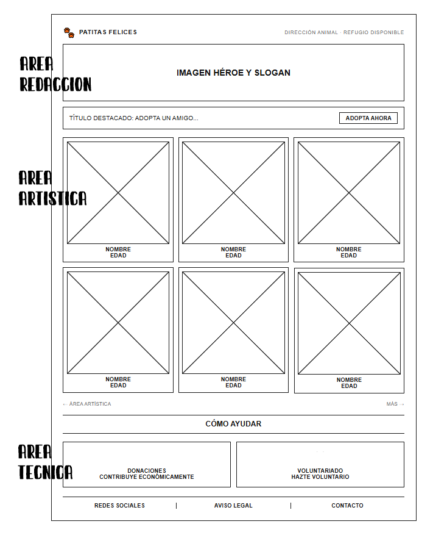

# Figma

## Áreas de trabajo en el desarrollo de un sitio web
Un mismo proyecto web se reparte en tres áreas de trabajo, y conviene saber distinguirlas porque luego se usan para rotular los bloques de un wireframe


| Área | Descripción |
|---|---|
| **Área de producción (o gestión de recursos)** | Hace referencia a la recopilación y optimización de recursos multimedia: fotografías de los animales, iconos, logotipos y vídeos corporativos |
| **Área técnica (front-end / maquetación)** | Se encarga de cómo se construye por debajo: estructura semántica en HTML5 (etiquetas `<header>`, `<main>`, `<section>`, `<footer>`), maquetación avanzada (CSS Grid o Flexbox) y la funcionalidad interactiva |
| **Área artística (diseño UI / estética)** | Se encarga del aspecto visual y la experiencia de usuario (UX/UI): paleta de colores corporativa, tipografías, espacios en blanco (padding y margins), diseño de botones y consistencia visual |

<br>

## Wireframes: Figma y Balsamiq
Para empezar a diseñar en soporte digital sin necesidad de código todavía, ```Figma``` y ```Balsamiq``` son las dos herramientas de referencia en la industria


| Apartado | Contenido |
|---|---|
| **Vídeos recomendados** | - **[Curso Figma desde CERO \| Curso de Introducción a Figma - YouTube](https://www.youtube.com/watch?v=SqO_-olNvnU)** (canal AlexCG Design): explica cómo moverse por el lienzo, crear marcos (frames) para dispositivos como iPhone o PC y utilizar formas básicas y textos<br><br>- **[Aprendiendo a usar Balsamiq Mockups - Fácil y Rápido - YouTube](https://www.youtube.com/watch?v=5mv63EUj5E4)** (canal Ferdream): muestra cómo arrastrar componentes precomputados (buscadores, mapas, tablas, navegadores) para crear un boceto web rápidamente<br><br>- **[Mario Germán Reyes: Aprende Figma en 10 mins - YouTube](https://www.youtube.com/watch?v=TdLi--ZfwPc)**: vídeo breve de introducción |
| **Por qué se elige Figma** | - **Ecosistema completo**: Balsamiq se queda en la baja fidelidad, mientras que Figma abarca desde wireframes de baja fidelidad hasta prototipos interactivos de alta fidelidad<br>- **Inspección de código**: permite consultar CSS, espaciados y variables directamente sobre el diseño<br>- **Trabajo colaborativo** en tiempo real<br>- **Cuenta de estudiante (Figma for Education)**: acceso gratuito a herramientas profesionales avanzadas y utilizadas en el desarrollo web y UX/UI |
| **Baja fidelidad (Low-fidelity)** | Boceto simple, normalmente en blanco y negro, centrado en la estructura y disposición de los bloques, sin detalles visuales finales. Es lo que se pide en el ejercicio en papel |
| **Alta fidelidad (High-fidelity)** | Prototipo cercano al diseño final, con colores, tipografías e interacciones reales |

<br>

## Comandos básicos de Figma
| Acción | Comando o efecto |
|---|---|
| Crear un frame | Tecla `F` |
| Zoom | `Ctrl` + rueda del ratón |
| Mantener proporciones simétricas | `Shift` + seleccionar un cuadrado o figura |
| Opacidad y color de una figura | Propiedad `Fill` (determina tanto la opacidad en % como el matiz de color) |
| Redondear esquinas | Propiedad `Corner radius` sobre la figura seleccionada |
| Transparencia respecto al fondo | Panel `Appearance`, para hacer un objeto opaco o translúcido respecto a lo que tiene debajo |
| Previsualizar el prototipo | Con el frame seleccionado, pestaña `Prototype` en el panel derecho y `Play`, muestra cómo se vería en el dispositivo elegido |
| Enlazar dos frames (navegación) | Al seleccionar la figura salen flechas de anclaje, se arrastran hasta la zona del otro frame al que debe llevar |
| Agrupar objetos | Seleccionar varios elementos y `Ctrl + G` |

<br>

## Glosario
**PRD (Product Requirement Document)**: documento de requisitos de producto, recoge qué debe hacer y cómo debe comportarse el producto antes de diseñarlo o construirlo

**Wireframe**: esqueleto o alambre de una pantalla, representa la disposición de los bloques de contenido sin entrar en el diseño visual final

<br>

## Ejercicio: wireframe de pantalla principal

<table>
  <tr>
    <th>Enunciado</th>
    <th>Ejemplo visual</th>
  </tr>
  
  <tr>
    <td width="50%" valign="top">
      <p>Diseñar el <b>wireframe en papel (low-fidelity)</b> para la pantalla principal de un sitio web dedicado a una protectora de animales local<br><br><b>Requisitos:</b></p>
      <ul>
        <li>Encabezado con navegación</li>
        <li>Zona de héroe (destacado)</li>
        <li>Listado de animales en adopción</li>
        <li>Sección de donaciones y voluntariado</li>
        <li>Pie de página</li>
        <li>Rotular al lado de cada bloque qué fase de desarrollo abarca ese contenido: <b>área de producción, área técnica o área artística</b>b></li>
      </ul>
    </td>
    <td width="50%" valign="top">
      <a href="https://github.com/estelaV9/DisenioInterfacesWeb/blob/master/Tema2_ElementosDise%C3%B1oWeb/img/wireframe_patitas_felices.png">
        
      </a>      
    </td>
  </tr>
</table>

[Wireframe]() final de **Patitas felices**


<br>

---
>_Estela de Vega Martín | IES Ribera de Castilla 26/27._
